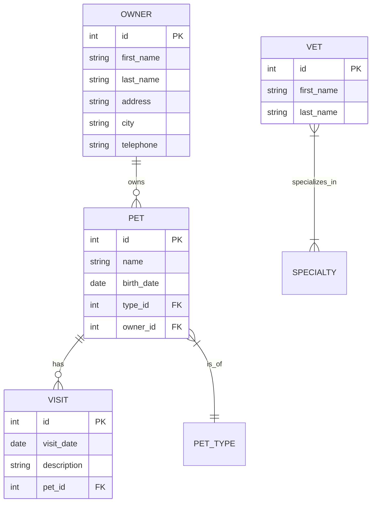

# L1: 系统架构与数据关系图

## 业务模块边界划分

- **Owner & Pet 聚合根**: 处理宠物主人的增删改查，以及他们名下的宠物和访问记录。
- **Vet 模块**: 提供兽医列表展示，集成底层缓存 (`@Cacheable("vets")`) 以优化性能。
- **System 模块**: 提供系统级探针能力（如引发故意崩溃的测试接口）。

## 数据流向与实体关系大纲

## 请求流转链路说明 (User Flow)
1. User 访问 `GET /owners/new` -> `OwnerController` 渲染 `createOrUpdateOwnerForm.html`
2. User 填写并 `POST /owners/new` -> `@Valid` 校验 -> `OwnerRepository.save()` -> H2 数据库持久化 -> 302 Redirect 至 `/owners/{id}`
